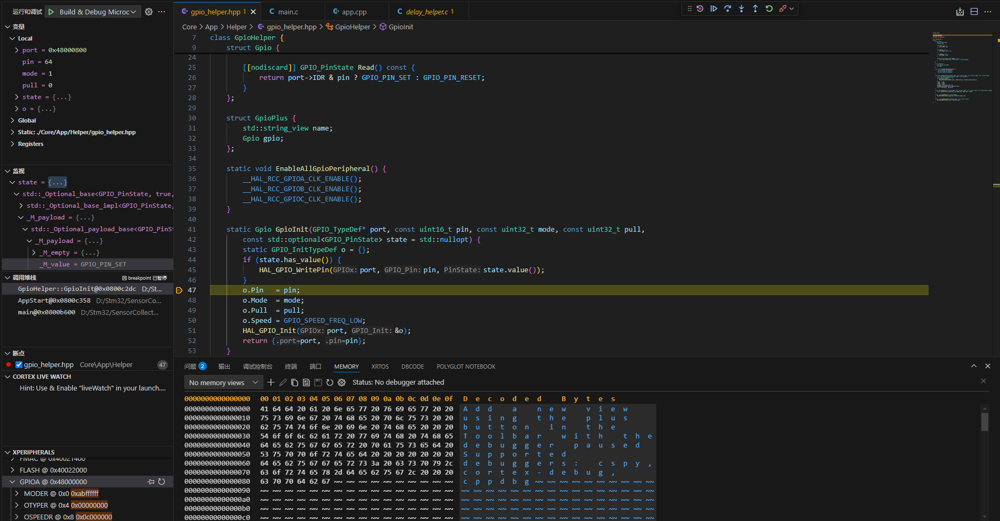

## 前言

在 STM32 的传统开发环境中，常见的选择是使用 MDK-ARM 或 IAR 等 IDE。然而，这些工具尽管功能强大，但在代码智能提示、现代化编辑体验等方面存在不足。VSCode 作为当今非常流行的代码编辑器，结合 Clangd 提供的强大代码分析能力，可以为 STM32 开发带来更现代化的体验，并且 VSCode 还有众多 AI 插件可以为代码进行补全。

> [!NOTE]
> **2025.10.21** 更新  
>   
> 文章写于[STM32 VS Code Extension](https://marketplace.visualstudio.com/items?itemName=STMicroelectronics.stm32-vscode-extension) 的 `v1.0` 时期  
>   
> 时代滚滚向前，笔者博客文章具有滞后性，目前拓展已经更新到了 `v3.6.4` 版本，相较于先前，配置更加简单，插件在安装后，会提示安装开发所需的工具链，所以只需要安装一个拓展（即 [STM32 VS Code Extension](https://marketplace.visualstudio.com/items?itemName=STMicroelectronics.stm32-vscode-extension)），按照提示安装工具链后，从 `CubeMX` 生成 `CMake` 项目即可，无需额外配置  
>   
> 所以可以基本跳过 [配置步骤](#配置步骤) 章节（不过仍然需要安装 [STM32CubeMX](https://www.st.com/en/development-tools/stm32cubemx.html) 来配置项目），您仍然可以参考 [增强配置](#增强配置) 以提供更好的开发体验  
>  
> 如果嫌弃 `STM32 VS Code Extension` 安装太多拓展导致 `VSCode` 界面混乱，可以巧用 `VSCode` 的 [配置文件](https://code.visualstudio.com/docs/configure/profiles) 功能

## 配置步骤

### 1. 基础环境安装

首先，下载并安装所需的基础工具：
- 安装 [Visual Studio Code](https://code.visualstudio.com)，代码编辑器
- 安装 [LLVM/Clang](https://github.com/llvm/llvm-project/releases)，提供 clangd 语言服务器
- 安装 [STM32CubeMX](https://www.st.com/en/development-tools/stm32cubemx.html)，用于生成 STM32 项目代码
- 安装 [STM32CubeCLT](https://www.st.com/en/development-tools/stm32cubeclt.html)，`STM32CubeCLT` 提供 STM32 开发工具集，包含 `arm-none-eabi-gcc` 编译器、STM32 的 `SVD` 文件，同时包含 `Ninja`、`CMake` 构建工具

确保 `llvm`、`cmake`、`arm-none-eabi-gcc`、`ninja` 已添加到系统环境变量，可以在命令行中执行 `clangd --version`、`cmake --version`、`arm-none-eabi-gcc --version`、`ninja --version` 进行验证。

### 2. 安装 VSCode 扩展

> [!TIP]
> clangd 插件与 [C/C++](https://marketplace.visualstudio.com/items?itemName=ms-vscode.cpptools) 插件冲突，clangd 需要禁用 C/C++ 插件才能正常工作。

在 VSCode 中，通过扩展市场安装以下必要扩展：
- [clangd](https://marketplace.visualstudio.com/items?itemName=llvm-vs-code-extensions.vscode-clangd) - 提供 C/C++ 代码智能感知
- [STM32 VS Code Extension](https://marketplace.visualstudio.com/items?itemName=STMicroelectronics.stm32-vscode-extension) - 提供 STM32 开发工具集

### 3. 配置 STM32 开发环境

安装完了 `STM32 VS Code Extension` 扩展后，需要配置 STM32CubeCLT 路径：
1. 在 VSCode 中，按下 `Ctrl + Shift + P` 打开命令面板
2. 搜索并选择 `STM32 VS Code Extension: Configure Cube CLT Path` 命令
3. 找到 `STM32CubeCLT` 并选择，如果 `STM32CubeCLT` 正确安装，VSCode 将自动检测到路径

### 4. 创建并配置项目

1. 使用 STM32CubeMX 创建新项目，在生成代码时选择 `CMake` 作为项目生成类型
2. 使用 VSCode 打开生成的项目文件夹
3. 在 VSCode 左侧边栏点击 `STM32 VS Code Extension` 扩展（ST 小蝴蝶标志），选择 `Import CMake Project` 选项
4. 在弹出的文件浏览器中，导航并选择刚才用 STM32CubeMX 生成的项目根目录

### 5. 配置 clangd

1. 在 VSCode 中，按下 `Ctrl + Shift + P` 打开命令面板
2. 搜索并选择 `首选项: 打开工作区设置(JSON)`
3. 在打开的 `settings.json` 文件中，添加以下配置：

```json
{
    "clangd.arguments": [
        "--query-driver=C:/ST/STM32CubeCLT_1.17.0/GNU-tools-for-STM32/bin/arm-none-eabi-*", // 修改为 arm-none-eabi-gcc 实际路径
        "--compile-commands-dir=${workspaceFolder}/build/Debug" // 修改为项目构建目录
    ],
}
```

### 6. 完成配置

1. 在 VSCode 中，按下 `Ctrl + Shift + P` 打开命令面板
2. 搜索并选择 `开发人员: 重新加载窗口` 或 `clangd: Restart language server`
3. 等待 VSCode 重新加载，clangd 将开始解析项目代码

至此，基本配置已完成。如果一切正常，您应该能看到代码智能提示正常工作，没有红色波浪线错误提示，并且由于使用了 `STM32 VS Code Extension` 扩展配置项目，在连接 ST-Link 后可以直接 `F5` 对程序进行调试。



## 增强配置

以下是一些可选的增强配置，可以进一步提升您的开发体验：

### 代码格式化配置

在项目根目录添加 `.clang-format` 文件，可以自定义代码格式化规则：

```yaml
# Generated by CLion for STL
BasedOnStyle: LLVM

AccessModifierOffset: -4
AlignAfterOpenBracket: DontAlign
AlignConsecutiveAssignments: Consecutive
AlignConsecutiveMacros: Consecutive
AlignEscapedNewlines: Left
AlignOperands: AlignAfterOperator
AlignTrailingComments:
  Kind: Never
AllowShortFunctionsOnASingleLine: Empty
AlwaysBreakTemplateDeclarations: Yes
BreakBeforeBinaryOperators: NonAssignment
ColumnLimit: 120
IncludeBlocks: Regroup
IncludeCategories:
  - Regex: '^<yvals(_core)?\.h>$'
    Priority: 1
  - Regex: '^<(Windows|userenv)\.h>$'
    Priority: 3
    SortPriority: 3
  - Regex: '^<WinIoCtl\.h>$'
    Priority: 3
    SortPriority: 4
  - Regex: '^<__.*\.hpp>$'
    Priority: 2
  - Regex: '\.hpp[>"]$'
    Priority: 5
  - Regex: '.*'
    Priority: 2
IndentCaseBlocks: true
IndentWidth: 4
IndentWrappedFunctionNames: true
InsertBraces: true
InsertNewlineAtEOF: true
MaxEmptyLinesToKeep: 2
NamespaceIndentation: All
PointerAlignment: Left
RemoveSemicolon: true
SpaceAfterCStyleCast: true
SpaceBeforeParens: Custom
SpaceBeforeParensOptions:
  AfterRequiresInClause: true
StatementMacros:
  - _EXTERN_CXX_WORKAROUND
  - _END_EXTERN_CXX_WORKAROUND
  - _STD_BEGIN
  - _STD_END
  - _STDEXT_BEGIN
  - _STDEXT_END
  - _FMT_P2286_BEGIN
  - _FMT_P2286_END
  - _EXTERN_C_UNLESS_PURE
  - _END_EXTERN_C_UNLESS_PURE

```

### 静态代码分析

在项目根目录添加 `.clang-tidy` 文件到项目根目录，开启更强大的代码静态分析：

```yaml
# Generated from CLion Inspection settings
---
Checks: '-*,
bugprone-argument-comment,
bugprone-assert-side-effect,
bugprone-bad-signal-to-kill-thread,
bugprone-branch-clone,
bugprone-copy-constructor-init,
bugprone-dangling-handle,
bugprone-dynamic-static-initializers,
bugprone-fold-init-type,
bugprone-forward-declaration-namespace,
bugprone-forwarding-reference-overload,
bugprone-inaccurate-erase,
bugprone-incorrect-roundings,
bugprone-integer-division,
bugprone-lambda-function-name,
bugprone-macro-parentheses,
bugprone-macro-repeated-side-effects,
bugprone-misplaced-operator-in-strlen-in-alloc,
bugprone-misplaced-pointer-arithmetic-in-alloc,
bugprone-misplaced-widening-cast,
bugprone-move-forwarding-reference,
bugprone-multiple-statement-macro,
bugprone-no-escape,
bugprone-parent-virtual-call,
bugprone-posix-return,
bugprone-reserved-identifier,
bugprone-sizeof-container,
bugprone-sizeof-expression,
bugprone-spuriously-wake-up-functions,
bugprone-string-constructor,
bugprone-string-integer-assignment,
bugprone-string-literal-with-embedded-nul,
bugprone-suspicious-enum-usage,
bugprone-suspicious-include,
bugprone-suspicious-memset-usage,
bugprone-suspicious-missing-comma,
bugprone-suspicious-semicolon,
bugprone-suspicious-string-compare,
bugprone-suspicious-memory-comparison,
bugprone-suspicious-realloc-usage,
bugprone-swapped-arguments,
bugprone-terminating-continue,
bugprone-throw-keyword-missing,
bugprone-too-small-loop-variable,
bugprone-undefined-memory-manipulation,
bugprone-undelegated-constructor,
bugprone-unhandled-self-assignment,
bugprone-unused-raii,
bugprone-unused-return-value,
bugprone-use-after-move,
bugprone-virtual-near-miss,
cert-dcl21-cpp,
cert-dcl58-cpp,
cert-err34-c,
cert-err52-cpp,
cert-err60-cpp,
cert-flp30-c,
cert-msc50-cpp,
cert-msc51-cpp,
cert-str34-c,
cppcoreguidelines-interfaces-global-init,
cppcoreguidelines-narrowing-conversions,
cppcoreguidelines-pro-type-member-init,
cppcoreguidelines-pro-type-static-cast-downcast,
cppcoreguidelines-slicing,
google-default-arguments,
google-explicit-constructor,
google-runtime-operator,
hicpp-exception-baseclass,
hicpp-multiway-paths-covered,
misc-misplaced-const,
misc-new-delete-overloads,
misc-no-recursion,
misc-non-copyable-objects,
misc-throw-by-value-catch-by-reference,
misc-unconventional-assign-operator,
misc-uniqueptr-reset-release,
modernize-avoid-bind,
modernize-concat-nested-namespaces,
modernize-deprecated-headers,
modernize-deprecated-ios-base-aliases,
modernize-loop-convert,
modernize-make-shared,
modernize-make-unique,
modernize-pass-by-value,
modernize-raw-string-literal,
modernize-redundant-void-arg,
modernize-replace-auto-ptr,
modernize-replace-disallow-copy-and-assign-macro,
modernize-replace-random-shuffle,
modernize-return-braced-init-list,
modernize-shrink-to-fit,
modernize-unary-static-assert,
modernize-use-auto,
modernize-use-bool-literals,
modernize-use-emplace,
modernize-use-equals-default,
modernize-use-equals-delete,
modernize-use-nodiscard,
modernize-use-noexcept,
modernize-use-nullptr,
modernize-use-override,
modernize-use-transparent-functors,
modernize-use-uncaught-exceptions,
mpi-buffer-deref,
mpi-type-mismatch,
openmp-use-default-none,
performance-faster-string-find,
performance-for-range-copy,
performance-implicit-conversion-in-loop,
performance-inefficient-algorithm,
performance-inefficient-string-concatenation,
performance-inefficient-vector-operation,
performance-move-const-arg,
performance-move-constructor-init,
performance-no-automatic-move,
performance-noexcept-move-constructor,
performance-trivially-destructible,
performance-type-promotion-in-math-fn,
performance-unnecessary-copy-initialization,
performance-unnecessary-value-param,
portability-simd-intrinsics,
readability-avoid-const-params-in-decls,
readability-const-return-type,
readability-container-size-empty,
readability-convert-member-functions-to-static,
readability-delete-null-pointer,
readability-deleted-default,
readability-inconsistent-declaration-parameter-name,
readability-make-member-function-const,
readability-misleading-indentation,
readability-misplaced-array-index,
readability-non-const-parameter,
readability-redundant-control-flow,
readability-redundant-declaration,
readability-redundant-function-ptr-dereference,
readability-redundant-smartptr-get,
readability-redundant-string-cstr,
readability-redundant-string-init,
readability-simplify-subscript-expr,
readability-static-accessed-through-instance,
readability-static-definition-in-anonymous-namespace,
readability-string-compare,
readability-uniqueptr-delete-release,
readability-use-anyofallof'
```

### 启用 C++ 支持

如需在项目中使用 C++，在 `CMakeLists.txt` 中添加以下语句：

```cmake
set(CMAKE_CXX_STANDARD 20)
set(CMAKE_CXX_STANDARD_REQUIRED ON)
set(CMAKE_CXX_EXTENSIONS ON)

enable_language(C ASM CXX) # 修改原有的 enable_language 行
```

这将启用 C++ 支持，并将 C++ 标准设置为 C++20。

### 生成 HEX 和 BIN 文件

为了方便固件烧录，可以在 `CMakeLists.txt` 中添加以下命令自动生成 hex 和 bin 文件：

```cmake
# Add custom command to generate binary and hex files
add_custom_command(TARGET ${CMAKE_PROJECT_NAME} POST_BUILD
    COMMAND ${CMAKE_OBJCOPY} -O binary ${CMAKE_PROJECT_NAME}.elf ${CMAKE_PROJECT_NAME}.bin
    COMMAND ${CMAKE_OBJCOPY} -O ihex ${CMAKE_PROJECT_NAME}.elf ${CMAKE_PROJECT_NAME}.hex
)
```

### 添加自定义源文件

为了更好地组织代码，可以将自己的源文件放在独立的目录中，在 `CMakeLists.txt` 中添加，比如我需要添加 `Core/App` 目录下的所有源文件：

```cmake
# Add sources path
file(GLOB_RECURSE SOURCES
    ${CMAKE_SOURCE_DIR}/Core/App/*.*
)

# Add sources to executable
target_sources(${CMAKE_PROJECT_NAME} PRIVATE
    # Add user sources here
    ${SOURCES}
)
```

### 添加自定义头文件路径

同样，可以添加自定义头文件路径，比如我需要添加 `Core/App` 目录下的头文件：

```cmake
# Add include paths
target_include_directories(${CMAKE_PROJECT_NAME} PRIVATE
    # Add user defined include paths
    ${CMAKE_SOURCE_DIR}/Core/App
)
```

### 优化编译选项

可以修改 `gcc-arm-none-eabi.cmake` 文件中的编译选项，根据需要启用或禁用特定功能：

```cmake
# 修改 C++ 标志，根据需要启用或禁用 RTTI 和异常
set(CMAKE_CXX_FLAGS "${CMAKE_C_FLAGS} -fno-rtti -fno-exceptions -fno-threadsafe-statics") 

set(CMAKE_C_LINK_FLAGS "${TARGET_FLAGS}")
set(CMAKE_C_LINK_FLAGS "${CMAKE_C_LINK_FLAGS} -T \"${CMAKE_SOURCE_DIR}/STM32F411XX_FLASH.ld\"")
# 删除 nano.specs 以使用完整标准库
set(CMAKE_C_LINK_FLAGS "${CMAKE_C_LINK_FLAGS} --specs=nano.specs")
set(CMAKE_C_LINK_FLAGS "${CMAKE_C_LINK_FLAGS} -Wl,-Map=${CMAKE_PROJECT_NAME}.map -Wl,--gc-sections")
set(CMAKE_C_LINK_FLAGS "${CMAKE_C_LINK_FLAGS} -Wl,--start-group -lc -lm -Wl,--end-group")
set(CMAKE_C_LINK_FLAGS "${CMAKE_C_LINK_FLAGS} -Wl,--print-memory-usage")

# 添加浮点数打印支持（如果使用完整标准库，可以不添加，因为完整标准库已经包含了浮点数打印支持）
set(CMAKE_C_LINK_FLAGS "${CMAKE_C_LINK_FLAGS} -u _printf_float")
set(CMAKE_CXX_LINK_FLAGS "${CMAKE_C_LINK_FLAGS} -Wl,--start-group -lstdc++ -lsupc++ -Wl,--end-group")
```

## 常见问题解决

### 智能提示不工作

1. 检查 clangd 扩展是否正确安装
2. 确保 clangd 已经成功构建了 `compile_commands.json` 文件
3. 验证 `settings.json` 中的编译器路径是否正确
4. clangd 插件可能会将 C++ 头文件 `.h` 错误识别为 C 头文件，特别是在使用 C++ 特性时，将导致解析错误，可以使用 `.hpp` 扩展名代替 `.h` 来命名 C++ 头文件