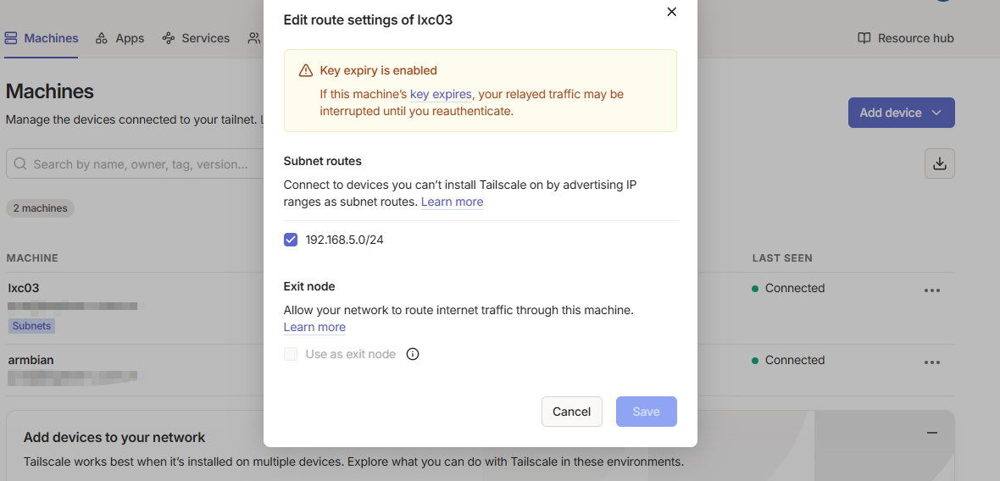
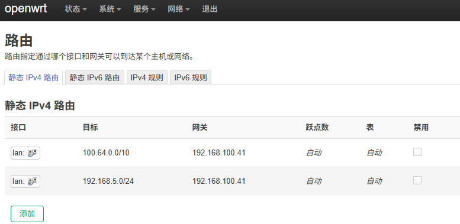
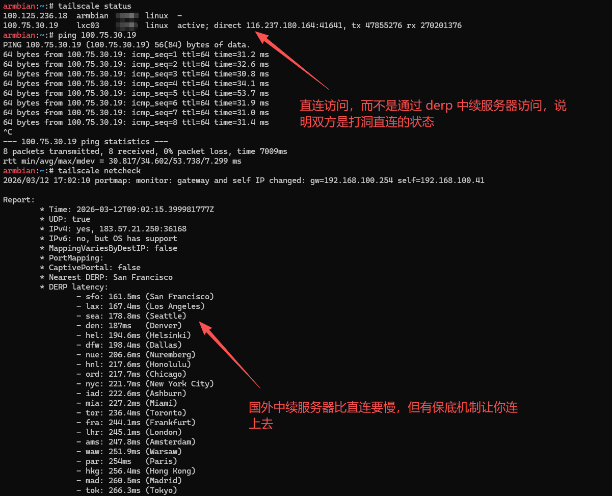

## 安装

[Tailscale](https://tailscale.com/download) 提供了多平台的安装包，按照提示安装即可。

如果是 Windows 用户，可以使用 winget 安装：
```bash
winget install tailscale
```

## 配置使用

假设我的网关是 `192.168.5.1`，Tailscale 在 LXC 容器里安装，LXC 容器 IP 是 `192.168.5.0/24` 网段中的一个 IP，那么通过以下的语句，其他设备在外网 Tailscale 组网后，可以访问到局域网 `192.168.5.0/24` 中的设备：

```bash
tailscale up --advertise-routes=192.168.5.0/24 --accept-routes --advertise-exit-node
```

语句说明：
- `--advertise-routes=192.168.5.0/24`：将局域网的路由广告给 Tailscale 网络，让其他设备可以访问到局域网中的设备。意思是当外网通过 Tailscale 组网后，可以访问 `192.168.5.0/24` 网段中的服务。
- `--accept-routes`：接受其他设备的子网路由，这样就可以访问到其他设备的局域网中的服务。比如另外一个 Tailscale 设备也广告了它所在局域网的路由（如 `192.168.100.0/24`），那么可以在 `192.168.5.0/24` 的设备里访问到 `192.168.100.0/24` 局域网服务（实现互相访问）。
- `--advertise-exit-node`：将此设备作为出口节点，允许其他设备通过此设备访问外部网络。不仅可以访问局域网中的设备，还可以通过此设备访问互联网，即所有流量都走此设备出口网络，类似全局代理的效果。

### 额外的一些配置

如果开启了局域网广播路由或出口节点，需要在 Tailscale 管理后台里授权此设备的路由和出口节点权限，授权后才能正常使用。



### 作为旁路由使用

如果想要实现透明组网，让局域网中的设备不需要安装 Tailscale 客户端就能访问到 Tailscale 网络中的设备，可以将安装了 Tailscale 的设备作为旁路由使用。比如我这里选用了一台装有 Armbian 系统的小主机作为旁路由，启动了 Tailscale 后，需要额外配置如下：

```bash
# 开启 IPv4 与 IPv6 转发，让设备能够在不同网卡之间转发流量，比如 eth0 到 tailscale0 网卡之间转发流量
echo 'net.ipv4.ip_forward = 1' | sudo tee -a /etc/sysctl.d/99-tailscale.conf
echo 'net.ipv6.conf.all.forwarding = 1' | sudo tee -a /etc/sysctl.d/99-tailscale.conf

# 重新加载 sysctl 让配置立即生效
sudo sysctl -p /etc/sysctl.d/99-tailscale.conf

# 配置 iptables 规则进行 NAT 伪装，所有流量伪装成该设备去发起访问，确保流量能够正确返回。
# 比如 Windows 主机发起的访问，到了 Armbian 旁路由这一层时，将流量伪装成 Armbian 设备去发起访问。
# 如果不用 MASQUERADE，远端的 LXC 节点收到包后，看到的是你局域网的私有 IP (192.168.100.x)。
# 远端节点根本不知道怎么把回程包发给这个私有 IP，导致通信中断。
iptables -t nat -A POSTROUTING -o tailscale0 -j MASQUERADE
```

对于局域网中的设备，需要将网关指向安装了 Tailscale 的设备 IP（比如我这里是 `192.168.100.41`），这样流量就会经过安装了 Tailscale 的设备进行转发，访问到 Tailscale 网络中的设备了。

如果可以进入网关的配置界面，也可以在网关里添加静态路由，让 Tailscale 的 IP 段走旁路由设备进行转发，这样就不需要修改局域网中设备的网关了。


<div class="text-center">网关 OpenWrt 配置静态路由，指定 IP 走旁路由设备进行转发</div>

这样配置下，处于 `192.168.100.x` 网段的设备就可以透明访问到 `192.168.5.x` 网段的设备了，尽管它们处于不同的网络。

### 检查连接情况

可以通过以下命令检查连接情况：
```bash
tailscale status
```



## 结尾

用过 Shadowsocks，也用过 WireGuard，但它们都需要公网才能正常访问到。与 Tailscale 相比，Tailscale 支持 DERP 服务器进行中转，并且在网络环境好的情况下，有概率实现 P2P 直连打洞访问，安全性也有保障，相比之下更加方便快捷。
