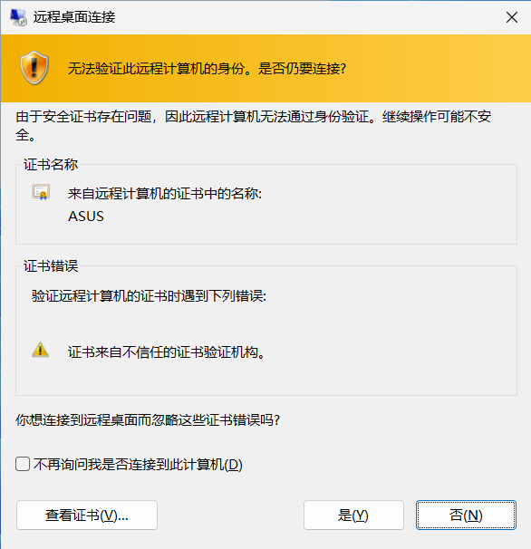

## 前言

在远程连接 Windows 服务器时，默认情况下 Windows 远程桌面服务使用自签名证书，这会导致客户端显示不安全连接警告。



通过配置有效的 SSL 证书，不仅可以消除这些警告，还能确保远程桌面连接的安全性和完整性。

本文将介绍如何使用 win-acme 工具自动获取 Let's Encrypt 免费 SSL 证书并配置到 Windows 远程桌面服务。win-acme 是一个强大的自动化工具，可以简化 Windows 系统上 SSL 证书的申请、配置和续期过程。

## 准备工作

在开始之前，你需要：

- 一个指向该服务器的域名（例如 rdp.yourdomain.com）
- 对域名 DNS 记录的管理权限
- 服务器上的管理员权限

## 配置 SSL 证书

### 1. 安装 win-acme

1. 在 [win-acme 发布页面](https://github.com/win-acme/win-acme/releases/) 下载最新版本的 win-acme，因为下面需要用到插件，所以需要选择 `pluggable` 版本
2. 将下载的 ZIP 文件解压到服务器上的一个永久位置，例如 `C:\win-acme`

### 2. 修改 win-acme 设置

1. `win-acme` 未启动前，文件夹里是不存在 `settings.json` 文件的，需要复制 `settings_default.json` 并重命名为 `settings.json`，或通过命令行输入 `./wacs.exe --version` 来生成（第一次运行 `wacs` 时会自动生成）
2. 按照 `win-acme` 的 [RDS 配置说明](https://www.win-acme.com/manual/advanced-use/examples/rds)，修改 `win-acme` 目录下的 `settings.json` 文件，将 `PrivateKeyExportable` 设置为 `true`

### 3. 准备 DNS 验证

要通过 Let's Encrypt 获取证书，需要验证你对域名的所有权。DNS 验证是最可靠的方式之一，特别是对于没有开放 80/443 端口的服务器。

根据你的[域名 DNS 提供商](https://www.win-acme.com/reference/plugins/validation/dns/)，你需要：

- 确认 win-acme 支持你的 DNS 提供商
- 获取必要的 API 凭据（如 API 密钥或 Token）

以 Cloudflare 为例：
1. 登录 Cloudflare 控制面板生成 API 令牌
2. 在 [win-acme 发布页面](https://github.com/win-acme/win-acme/releases/) 下载 cloudflare 验证插件
3. 按照 [Cloudflare 插件说明](https://www.win-acme.com/reference/plugins/validation/dns/cloudflare)，将插件放在 `win-acme` 目录下
4. 可以通过 `./wacs.exe --verbose` 查看插件是否加载成功

### 4. 准备导入脚本

将下面的脚本保存为 `CustomImportRDS.ps1`，放在 `win-acme` 目录下的 Scripts 文件夹中。

这个脚本基于 win-acme 的原始 `ImportRDS.ps1` 脚本修改而来，主要功能是：
- 将证书导入到 Windows 证书存储
- 配置远程桌面服务使用该证书
- 为证书私钥添加必要的权限

```powershell
<#
.SYNOPSIS
Imports a cert from WACS renewal into the RD Gateway and RD Listener

.DESCRIPTION
Note that this script is intended to be run via the install script plugin from win-acme via the batch script wrapper. As such, we use positional parameters to avoid issues with using a dash in the cmd line.

Proper information should be available here

https://github.com/PKISharp/win-acme/wiki/Install-Script

or more generally, here

https://github.com/PKISharp/win-acme/wiki/Example-Scripts

.PARAMETER NewCertThumbprint
The exact thumbprint of the cert to be imported. The script will copy this cert to the Personal store if not already there.

.EXAMPLE

ImportRDS.ps1 <certThumbprint>

.NOTES

#>

param(
    [Parameter(Position = 0, Mandatory = $true)]
    [string]$NewCertThumbprint
)

function Write-Log {
    param($Message)
    Write-Host $Message
}

Write-Log "Script started with thumbprint: $NewCertThumbprint"

Write-Log "Searching for certificate in store..."
try {
    $store = New-Object System.Security.Cryptography.X509Certificates.X509Store("My", "LocalMachine")
    $store.Open([System.Security.Cryptography.X509Certificates.OpenFlags]::ReadOnly)
    $CertInStore = $store.Certificates | Where-Object { $_.Thumbprint -eq $NewCertThumbprint } | Select-Object -First 1
    $store.Close()
    Write-Log "Certificate search completed"
}
catch {
    Write-Log "Failed to search for certificate: $($_.Exception.Message)"
    return
}

if ($CertInStore) {
    Write-Log "Certificate found in store"

    # 将证书指纹转换为字节数组
    try {
        $ThumbprintBytes = $CertInStore.Thumbprint -replace '([A-Fa-f0-9]{2})', '0x$1' -split '0x' | Where-Object { $_ -ne '' } | ForEach-Object { [byte]('0x' + $_) }
        Write-Log "Thumbprint converted to bytes"
    }
    catch {
        Write-Log "Failed to convert thumbprint: $($_.Exception.Message)"
        return
    }

    # 修改计算机注册表 \HKEY_LOCAL_MACHINE\SYSTEM\CurrentControlSet\Control\Terminal Server\WinStations\RDP-Tcp\SSLCertificateSHA1Hash 的值为二进制格式
    try {
        Write-Log "Updating registry for RDP listener..."
        Set-ItemProperty -Path 'HKLM:\SYSTEM\CurrentControlSet\Control\Terminal Server\WinStations\RDP-Tcp' -Name 'SSLCertificateSHA1Hash' -Value ([byte[]]$ThumbprintBytes) -ErrorAction Stop
        Write-Log "Registry value for RDP listener updated successfully"
    }
    catch {
        Write-Log "Failed to update registry value for RDP listener: $($_.Exception.Message)"
        return
    }

    # 为证书的私钥添加 NETWORK SERVICE 用户并授予读取权限
    try {
        Write-Log "Adding NETWORK SERVICE permissions to private key..."

        if ($CertInStore.HasPrivateKey) {
            $privateKey = $CertInStore.PrivateKey

            if ($privateKey -and $privateKey.CspKeyContainerInfo) {
                $keyContainerName = $privateKey.CspKeyContainerInfo.UniqueKeyContainerName
                $keyFilePath = Join-Path "C:\ProgramData\Microsoft\Crypto\RSA\MachineKeys" $keyContainerName

                Write-Log "Private key file path: $keyFilePath"

                if (Test-Path $keyFilePath) {
                    $fileInfo = New-Object System.IO.FileInfo($keyFilePath)
                    $fileSecurity = $fileInfo.GetAccessControl()

                    # 创建 NETWORK SERVICE 的访问规则
                    $networkServiceSid = New-Object System.Security.Principal.SecurityIdentifier("S-1-5-20")
                    $accessRule = New-Object System.Security.AccessControl.FileSystemAccessRule(
                        $networkServiceSid,
                        [System.Security.AccessControl.FileSystemRights]::Read,
                        [System.Security.AccessControl.AccessControlType]::Allow
                    )

                    $fileSecurity.AddAccessRule($accessRule)
                    $fileInfo.SetAccessControl($fileSecurity)

                    Write-Log "NETWORK SERVICE permissions added to private key successfully"
                }
                else {
                    Write-Log "Private key file not found at: $keyFilePath"
                }
            }
            else {
                Write-Log "Certificate private key information not available"
            }
        }
        else {
            Write-Log "Certificate does not have a private key"
        }
    }
    catch {
        Write-Log "Failed to add NETWORK SERVICE user to the certificate's private key: $($_.Exception.Message)"
    }
}
else {
    Write-Log "Cert thumbprint not found in the My cert store... have you specified --certificatestore My?"
}

Write-Log "Script completed"
```

### 5. 申请并安装证书

以**管理员模式**打开命令提示符或 PowerShell，切换到 win-acme 目录，然后运行以下命令：

```powershell
./wacs.exe --source manual --host YOUR_DOMAIN --validation cloudflare --cloudflareapitoken YOUR_API_TOKEN --certificatestore My --installation script --script "Scripts\CustomImportRDS.ps1" --scriptparameters "{CertThumbprint}"
```

命令参数说明：
- `--source manual`：手动指定域名
- `--host YOUR_DOMAIN`：替换为你的实际域名
- `--validation cloudflare`：DNS 验证提供商，根据你的实际情况替换
- `--cloudflareapitoken YOUR_API_TOKEN`：替换为你的 API 令牌
- `--certificatestore My`：将证书安装到计算机的个人证书存储
- `--installation script`：使用脚本安装证书
- `--script "Scripts\CustomImportRDS.ps1"`：指定安装脚本
- `--scriptparameters "{CertThumbprint}"`：传递证书指纹参数

如果初次运行命令，win-acme 会提示阅读 `letsencrypt` 的文档，并需要输入一些信息，例如邮箱，如果一切正常，win-acme 将会：
1. 尝试往你的域名供应商写入 TXT 记录，用以证明对该域名的所有权，验证通过后，win-acme 申请 Let's Encrypt 证书
2. 将证书安装到系统证书存储
3. 通过脚本配置远程桌面服务使用该证书
4. 创建自动续期任务

## 验证证书安装

### 查看证书状态

1. 按 `Win + R` 打开运行对话框，输入 `certlm.msc` 打开本地计算机证书管理器。
2. 在左侧导航栏中，展开 "个人" > "证书"。
3. 找到你的域名证书，确认证书已经成功导入。
4. 双击证书查看详细信息，确认：
   - 颁发者是 "R11" 或类似的 Let's Encrypt 颁发机构
   - 证书的有效期是否正确
   - 证书的通用名称是否匹配你的域名
5. 右键证书，导航栏中，选择 "所有任务" > "管理私钥" 点击，查看 `NETWORK SERVICE` 用户是否添加并具备允许读取权限

### 测试远程桌面连接

1. 从另一台计算机尝试远程桌面连接，使用域名而不是 IP 地址连接
2. 当连接建立时，查看连接安全信息，应该不再显示证书警告
3. 点击连接信息图标，查看证书详情，确认正在使用新安装的 Let's Encrypt 证书

## 证书自动更新

win-acme 会在 Windows 计划任务中创建一个定期运行的任务，确保在证书过期前自动续期。

查看自动更新任务：
1. 打开任务计划程序（按 `Win + R`，输入 `taskschd.msc`）
2. 在左侧导航栏中，找到 "任务计划程序库" > "win-acme renew"
3. 查看证书续期任务的详细信息和计划

## 证书申请失败

如果证书申请失败，可能的原因包括：
- DNS 验证失败：检查 API 令牌权限和 DNS 提供商设置
- 网络连接问题：确保服务器可以访问 Let's Encrypt API
- 请求频率限制：Let's Encrypt 有严格的速率限制，短时间内多次失败请求可能触发限制