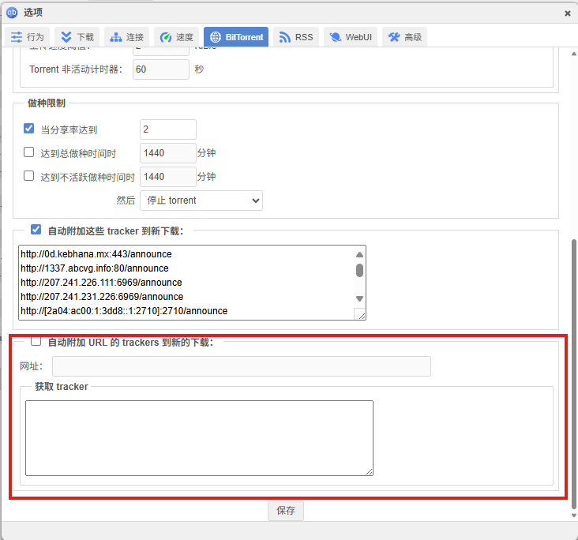

## 前言

BitTorrent 网络中，tracker 帮助 P2P 客户端找到拥有相同种子的其他用户，因此定期更新 tracker 列表可以获得更好的下载体验。

常用的 tracker 列表源包括：
- [https://cf.trackerslist.com/all.txt](https://cf.trackerslist.com/all.txt)
- [https://cf.trackerslist.com/best.txt](https://cf.trackerslist.com/best.txt)

> [!NOTE]
> 从 qBittorrent 5.10 版本开始，客户端已经原生支持通过 URL 获取 tracker 列表的功能，无需额外脚本即可实现自动更新。详情请参考 [qBittorrent 5.10 更新日志](https://github.com/qbittorrent/qBittorrent/blob/da87be2b12893dfb769df8124afeb064f099dc71/Changelog#L7)。
>
> 如果你使用的是 5.10 或更高版本，可以直接在 qBittorrent 的设置中配置 tracker URL。



> [!TIP]
> 一些 PT（Private tracker）站点对客户端有要求，必须使用原版 qBittorrent 客户端而非修改版（如 [qBittorrent-Enhanced-Edition](https://github.com/c0re100/qBittorrent-Enhanced-Edition)）。

## 脚本特点

- **多源获取**：自动从多个 tracker 源获取最新列表，确保资源可达性
- **自定义支持**：允许添加个人专用 tracker，满足特定下载需求
- **自动去重**：智能删除重复 tracker，优化客户端性能

## 环境准备

### 安装青龙面板

[青龙面板](https://qinglong.online/)是一个支持 Python、Node.js、Shell 等多语言的定时任务管理工具，非常适合自动化脚本的定时执行。

可以使用 Docker [安装青龙面板](https://qinglong.online/guide/getting-started/installation-guide/docker)：

```bash
docker run -dit -v $PWD/ql/data:/ql/data -p 5700:5700 -e QlBaseUrl="/" -e QlPort="5700" --name qinglong --hostname qinglong --restart unless-stopped whyour/qinglong:latest
```

安装完成后，通过浏览器访问 `http://服务器IP:5700` 进行初始化配置：
1. 设置管理员用户名和密码
2. 登录到青龙面板后台

### 确保 qBittorrent WebUI 已启用（docker 版默认启用）

在 qBittorrent 中：
1. 工具 → 设置 → Web UI
2. 启用 Web 用户界面
3. 设置用户名和密码
4. 记下访问地址（如 `http://192.168.1.100:8080`）

## 脚本配置

### 1. 安装依赖

首先需要安装脚本所需的 Python 依赖：

1. 在青龙面板中，进入【依赖管理】
2. 点击右上角【+】号创建依赖
3. 依赖类型选择 python3，填写名称 `qbittorrent-api`，其他保持默认
4. 点击确定，青龙面板会自动安装依赖包
5. 点击【日志】按钮查看安装结果

### 2. 添加脚本

接下来添加自动更新 tracker 的 Python 脚本：

1. 在青龙面板中，进入【脚本管理】
2. 点击右上角【+】号创建空文件
3. 填写文件名，比如 `qbittorrent_tracker_updater.py`
4. 点击确定创建文件
5. 将以下代码复制到文件中并保存：

```python
#!/usr/bin/env python3
# -*- coding: utf-8 -*-
"""
从多个来源获取 BT tracker 列表并更新到 qBittorrent 配置中。

所需 pip 包:
- qbittorrent-api
"""

import os
import sys
import logging
from typing import List

import requests
import qbittorrentapi


# 配置日志
logging.basicConfig(
    level=logging.INFO,
    format="%(asctime)s - %(levelname)s - %(message)s",
    datefmt="%Y-%m-%d %H:%M:%S"
)
logger = logging.getLogger("qbittorrent_trackers_updater")


def get_environment_config() -> tuple:
    """从环境变量获取配置信息"""
    qb_url = os.environ.get(
        "QBITTORRENT_URL")  # 例如: "http://192.168.1.100:8080"
    qb_username = os.environ.get("QBITTORRENT_USER")  # 例如: "admin"
    qb_password = os.environ.get("QBITTORRENT_PASSWORD")  # 例如: "adminpassword"

    # 从环境变量获取 tracker URL 列表，多个 URL 用分号分隔
    # 例如: "https://cf.trackerslist.com/all.txt;https://cf.trackerslist.com/best.txt"
    tracker_urls = os.environ.get("QBITTORRENT_tracker_URLS")

    # 从环境变量获取自定义 tracker，多个 tracker 用分号分隔
    # 例如: "udp://tracker.example1.com:6969;udp://tracker.example2.com:6969"
    custom_trackers = os.environ.get("QBITTORRENT_CUSTOM_trackerS", "")

    # 默认 tracker URL
    default_tracker_url = "https://cf.trackerslist.com/all.txt"
    if not tracker_urls:
        tracker_urls = default_tracker_url

    return qb_url, qb_username, qb_password, tracker_urls, custom_trackers


def fetch_trackers(urls: List[str]) -> List[str]:
    """从给定的URLs获取tracker列表"""
    logger.info("正在获取 tracker 列表...")
    all_trackers = []

    for url in urls:
        logger.info(f"从 {url} 获取trackers...")

        try:
            response = requests.get(url, timeout=10)
            if response.status_code == 200:
                # 获取并处理内容
                new_trackers = [
                    tracker for tracker in response.text.strip().split("\n")
                    if tracker.strip()
                ]

                if new_trackers:
                    all_trackers.extend(new_trackers)
                    logger.info(f"成功从 {url} 获取tracker列表")
                else:
                    logger.warning(f"从 {url} 获取的tracker列表为空")
            else:
                logger.error(f"无法从 {url} 获取数据，HTTP状态码: {response.status_code}")
        except Exception as e:
            logger.error(f"获取 {url} 时出错: {str(e)}")
            continue

    return all_trackers


def add_custom_trackers(all_trackers: List[str], custom_trackers: str) -> List[str]:
    """添加自定义trackers到现有列表"""
    if not custom_trackers:
        return all_trackers

    custom_trackers_list = [
        tracker for tracker in custom_trackers.split(";") if tracker.strip()
    ]
    if custom_trackers_list:
        all_trackers.extend(custom_trackers_list)
        logger.info("已添加自定义trackers")

    return all_trackers


def update_qbittorrent_trackers(
    qb_url: str,
    qb_username: str,
    qb_password: str,
    unique_trackers: List[str]
) -> bool:
    """更新qBittorrent的tracker设置"""
    if not all([qb_url, qb_username, qb_password]):
        logger.error("错误: qBittorrent 配置不完整，请检查环境变量")
        return False

    client = None
    try:
        logger.info("正在连接 qBittorrent...")
        # 实例化客户端
        client = qbittorrentapi.Client(
            host=qb_url,
            username=qb_username,
            password=qb_password
        )

        # 登录检查
        client.auth_log_in()

        # 获取版本信息
        version = client.app_version()
        logger.info(f"qBittorrent 版本: {version}")

        # 将tracker列表转换为换行符分隔的字符串
        trackers_str = "\n".join(unique_trackers)

        # 设置首选项
        logger.info("正在更新 trackers...")
        client.app_set_preferences({
            "add_trackers_enabled": True,
            "add_trackers": trackers_str
        })

        logger.info("trackers 更新成功")
        return True

    except qbittorrentapi.LoginFailed as e:
        logger.error(f"qBittorrent 登录失败: {str(e)}")
        return False
    except qbittorrentapi.APIConnectionError as e:
        logger.error(f"qBittorrent API 连接错误: {str(e)}")
        return False
    except Exception as e:
        logger.error(f"发生错误: {str(e)}")
        return False
    finally:
        # 尝试登出（如果已登录）
        try:
            if client is not None:
                client.auth_log_out()
        except Exception:
            pass


def main() -> int:
    """主函数"""
    # 获取配置
    qb_url, qb_username, qb_password, tracker_urls_str, custom_trackers = get_environment_config()

    # 解析tracker URL列表
    tracker_urls = [url.strip()
                    for url in tracker_urls_str.split(";") if url.strip()]

    # 获取trackers
    all_trackers = fetch_trackers(tracker_urls)

    # 检查是否成功获取了任何tracker
    if not all_trackers:
        logger.error("从所有URL获取trackers失败，退出")
        return 1

    # 添加自定义trackers
    all_trackers = add_custom_trackers(all_trackers, custom_trackers)

    # 去重并排序
    unique_trackers = sorted(set(all_trackers))

    # 统计
    tracker_count = len(unique_trackers)
    logger.info(f"总共获取到 {tracker_count} 个唯一的tracker")

    # 更新qBittorrent
    success = update_qbittorrent_trackers(
        qb_url, qb_username, qb_password, unique_trackers)

    return 0 if success else 1


if __name__ == "__main__":
    sys.exit(main())
```

### 3. 添加环境变量

配置脚本所需的环境变量：

1. 在青龙面板中，进入【环境变量】
2. 点击右上角【+】号创建变量，添加以下必要变量：
   - 变量名：`QBITTORRENT_URL` 
     值：你的 qBittorrent WebUI 地址（如 `http://192.168.1.100:8080`）
   - 变量名：`QBITTORRENT_USER` 
     值：qBittorrent WebUI 的用户名
   - 变量名：`QBITTORRENT_PASSWORD` 
     值：qBittorrent WebUI 的密码

3. 可选环境变量：
   - 变量名：`QBITTORRENT_tracker_URLS` 
     值：自定义 tracker 列表源，多个用分号分隔
     例如：`https://cf.trackerslist.com/all.txt;https://cf.trackerslist.com/best.txt`
   - 变量名：`QBITTORRENT_CUSTOM_trackerS` 
     值：自定义 tracker 地址，多个用分号分隔
     例如：`udp://tracker.example1.com:6969;udp://tracker.example2.com:6969`

### 4. 添加定时任务

设置脚本的定时执行计划：

1. 在青龙面板中，进入【定时任务】
2. 点击右上角【+】号创建任务
3. 填写以下信息：
   - 名称：`更新 qBittorrent tracker`
   - 命令：`task qbittorrent_tracker_updater.py`
   - 定时类型：选择【常规定时】
   - 定时规则：`0 7 * * *`（表示每天早上 7 点执行一次）
4. 点击确定保存任务

### 5. 测试任务

创建完成后，可以立即测试任务是否正常运行：

1. 在【定时任务】页面找到刚创建的任务
2. 点击右侧【运行】按钮
3. 点击【日志】按钮查看运行结果

正常情况下，你会看到类似如下日志：
```
## 开始执行... 2025-03-31 22:37:22

2025-03-31 22:37:23 - INFO - 正在获取 tracker 列表...
2025-03-31 22:37:23 - INFO - 从 https://cf.trackerslist.com/all.txt 获取 trackers...
2025-03-31 22:37:24 - INFO - 成功从 https://cf.trackerslist.com/all.txt 获取 tracker 列表
2025-03-31 22:37:24 - INFO - 总共获取到 157 个唯一的 tracker
2025-03-31 22:37:24 - INFO - 正在连接 qBittorrent...
2025-03-31 22:37:24 - INFO - qBittorrent 版本: v5.0.4
2025-03-31 22:37:24 - INFO - 正在更新 trackers...
2025-03-31 22:37:24 - INFO - trackers 更新成功

## 执行结束... 2025-03-31 22:37:24  耗时 2 秒
```

## 常见问题排查

1. **连接错误**：确认 qBittorrent WebUI 是否启用，URL、用户名和密码是否正确。

2. **依赖问题**：如果脚本运行报错，检查 `qbittorrent-api` 依赖是否成功安装。

3. **权限问题**：确保 qBittorrent 用户有权限修改配置文件。

4. **自定义 tracker 源**：如果默认 tracker 源无法访问，可以尝试设置 `QBITTORRENT_tracker_URLS` 环境变量使用其他源。

5. **日志查看**：任务执行完成后，可以通过青龙面板的日志功能查看详细执行情况。