## 起因

一切的起源都起源于 2023 年 3 月时，因为 Chia 币矿难，那时流出来的矿盘特别便宜，笔者先后入手了一块 14 TB 东芝 MG08，一块 16 TB 西数 HC550，原本想着只是作为电脑主机的存储盘使用，但按捺不住想折腾的心，购入了一台惠普 800 G3 主机作为 NAS，CPU 是 i3-7100T。在主机上引导安装黑群晖之后，看到原来有这么多有趣的套件可以使用，其中就了解到 Jellyfin，但也只是简单用用，仍然是个菜鸡。

在这中间的过程中，同事也 DIY 组装了一台性能非常强大的机器，并且装的是一个叫 [Proxmox (PVE)](https://www.proxmox.com/en/) 的系统，这我看的，开源免费，又能跑多个虚拟机和容器，就想着我也应该这样搞，于是后来购入了一台天钡 N100（被低功耗和新特性的宣传给忽悠了，实际 N100 真正跑起来功耗并不低，跟 i3-7100T 性能半斤八两，性能弱鸡）双盘位的小主机作为 All in One (AIO)，很自然在上面也安装了 PVE。那时飞牛（[FnOS](https://www.fnnas.com/)）还没有出，选择了最主流的黑群晖方案，最后形成了 OpenWrt 主路由拨号 + 黑群晖虚拟机 + 各种 LXC 容器的架构。

又是那位同事，跟他互相交流的过程中，提及了 Arr 系列的套件（也是本文后面基于 Arr 系列构建影视库管理所需要的软件），才知道原来是有一整套开源方案，可以把影视资源管理得这么好，且完全开源免费，由此基于同事的思路，开始了补完计划。

## 前言

- 笔者目前所有搭建的服务都运行在 LXC 容器中，系统是 Debian 12，使用默认 root 账户搭建服务。选择 LXC 的原因是，资源占用相较于虚拟机要求更低，性能更好，且相较于虚拟机需要直通 GPU 才能实现转码，LXC 容器可以直接使用宿主机的 GPU 资源，甚至支持多个 LXC 容器同时调用宿主机资源（比如 LXC01 运行 Jellyfin 调用 GPU 进行转码的同时，LXC02 运行 [Immich](https://immich.app/) 调用 GPU 进行智能搜索，这是没有问题的）。
- 所有的服务都使用 Docker 容器化部署，避免污染宿主机和 LXC 容器，方便管理数据和迁移，且大部分使用 [LinuxServer](https://www.linuxserver.io/) 提供的官方镜像，长期维护，且社区活跃，遇到问题也比较好解决。
- 尽量使用 Docker Compose 进行编排管理而非 `docker run`，方便一键启动和停止，也同时记录配置，方便日后维护。
- 对于一些技术原理，笔者也只是了解个大概，本文主要是介绍如何搭建和使用，以及有什么现象，相当于一个使用总结。至于原理方面的内容，也只是半桶水水平，技术解释合理性方面不能面面俱到解释清楚。
- 对于配置过程中遇到的问题，可以善问 AI 去解决，AI 比我知道更多

## 框架

qBittorrent 作为下载工具，Prowlarr 作为索引器管理，Sonarr 管理电视剧，Radarr 管理电影，Lidarr 管理音乐，Jellyfin 作为媒体服务器，Bazarr 作为字幕管理工具，Seerr 作为媒体请求工具。


<div class="text-center">框架图</div>

<details>
<summary>Mermaid 流程图源码</summary>

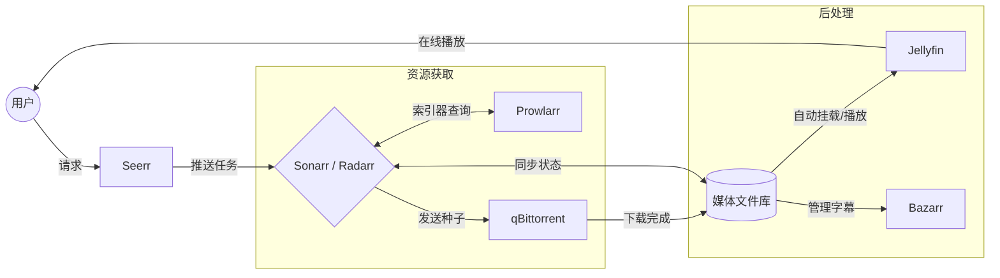

</details>

## qBittorrent

qBittorrent 作为开源免费的 BT 下载工具，功能强大且易用，支持 WebUI 远程管理，完全可以满足个人影视库的下载需求，可以通过 Docker 快速部署。


<div class="text-center">qBittorrent 界面</div>

### 安装

可以参考 LinuxServer 提供的 [文档](https://docs.linuxserver.io/images/docker-qbittorrent/) 进行搭建，运行容器后可以通过 `docker logs qbittorrent` 来查看初始化的账号和密码，进入界面后务必对密码进行修改。

<details>
<summary>qBittorrent docker compose 示例</summary>

```yaml
---
services:
  qbittorrent:
    image: lscr.io/linuxserver/qbittorrent:latest
    container_name: qbittorrent
    environment:
      - PUID=1000
      - PGID=1000
      - TZ=Asia/Shanghai
      - WEBUI_PORT=8080
      - TORRENTING_PORT=6881 # 可以根据需要修改默认的监听端口
    volumes:
      - /path/to/qbittorrent/appdata:/config
      - /path/to/downloads:/downloads
    network_mode: host
    restart: unless-stopped
```

</details>

### 一些 qBittorrent 配置建议

- 如果使用 Docker 部署，建议使用 Host 网络模式。这样少了一层网络转换，性能更好。且现如今 IPv6 已经比较普及，使用 Host 网络将会自动使用 LXC 容器上的 IPv6 地址，避免了桥接 (Bridge) 网络下 IPv6 无法使用的问题。

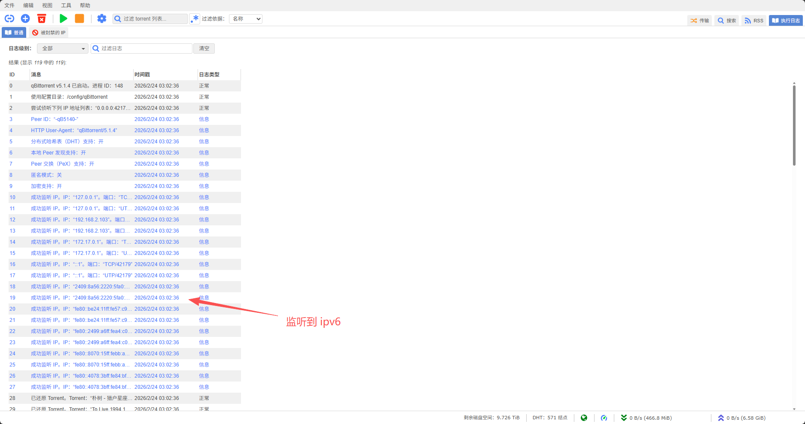
<div class="text-center">qBittorrent 获取到 IPv6 地址</div>

- 默认的监听端口是 6881，可以尽量选择高位的端口，需要在路由器上做端口开放映射。对于 IPv4 需要端口转发，对于 IPv6 则开放端口。你可以通过 [Port Forwarding Tester](https://www.yougetsignal.com/tools/open-ports/) 检测端口是否开放成功，可以通过 qBittorrent 界面的连接状态确认是否完全开放（WebUI 界面底部状态栏）。当然也可以通过开启 UPnP 来自动完成端口映射，但 UPnP 的安全性较差，可能会被恶意软件利用，还是建议手动设置端口映射。
- 在 qBittorrent 5.1 版本更新中，增加了对 Torrent 附加 Tracklist 的支持，建议开启该功能，可以增加更多的 Trackers，提高下载速度和成功率。

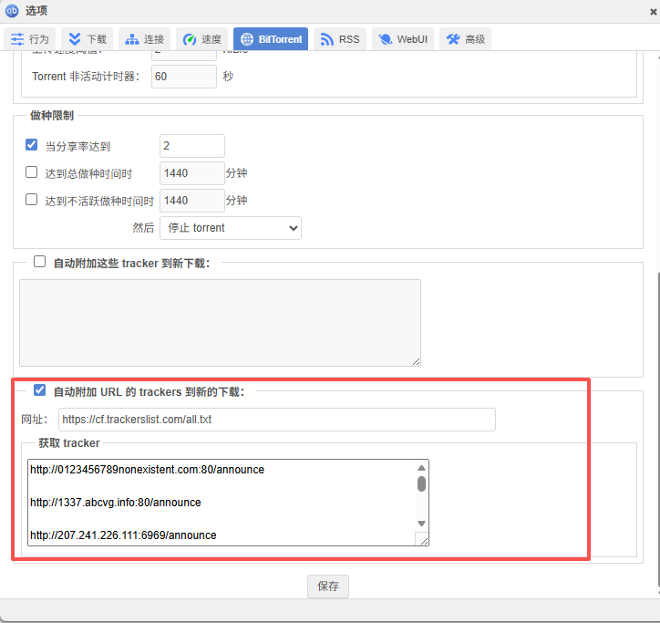
<div class="text-center">qBittorrent 自动添加 Trackers 到新的下载</div>

- 如果不想家宽因为上传过多被运营商判断为 PCDN 或影响自身上网使用体验，可以设置限速，并在达到一定分享率后自动停止种子。

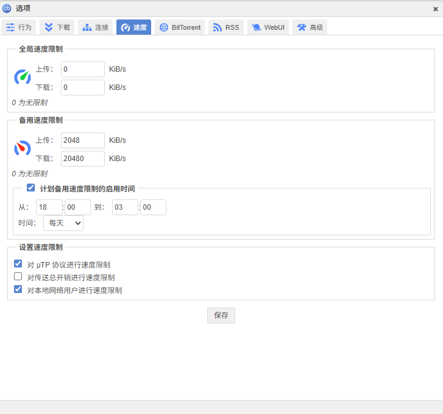
<div class="text-center">qBittorrent 限速设置</div>

对于 qBittorrent，如果不需要对参数进行过多优化的话，使用默认参数即可，这差不多就算折腾完了。

## Sonarr

Sonarr 是 Arr 家族中负责电视项目管理的工具，支持自动搜索、下载、整理和管理电视剧资源。其可以通过 Prowlarr 提供的索引器进行搜索，并通过 qBittorrent 进行下载，最后将下载好的资源整理到指定的目录中，方便 Jellyfin 进行媒体库管理。


<div class="text-center">Sonarr 界面</div>

### 安装

可以参考 LinuxServer 提供的 [文档](https://docs.linuxserver.io/images/docker-sonarr/) 进行搭建。

<details>
<summary>Sonarr Docker Compose 示例</summary>

```yaml
---
services:
  sonarr:
    image: lscr.io/linuxserver/sonarr:latest
    container_name: sonarr
    environment:
      - PUID=1000
      - PGID=1000
      - TZ=Asia/Shanghai
    volumes:
      - /path/to/sonarr/data:/config
      - /path/to/tvseries:/tv # Jellyfin 的电视剧媒体库目录
      - /path/to/downloadclient-downloads:/downloads # qBittorrent 的下载目录
    network_mode: bridge
    ports:
      - 8989:8989
    restart: unless-stopped
```

</details>

进入界面后，可以通过 Settings -> UI 来设置界面语言为中文。


<div class="text-center">Sonarr 设置界面语言为中文</div>

### 配置下载客户端

- 在 Sonarr 界面左侧导航栏选择“设置”，然后选择“下载客户端”，点击“加号”，选择 qBittorrent，填写对应的地址和账号密码，保存即可。
- 如果你的下载器和 Sonarr 不在同一个 LXC 容器中（这样更加安全，理论上 qBittorrent 会暴露你的地址），需要设置远程路径映射。具体操作是在 Sonarr 的“下载客户端”设置里，找到“远程路径映射”，点击“加号”，在“主机”中填写 qBittorrent 所在的 LXC 容器的地址，在“远程路径”中填写 qBittorrent 的下载目录，在“本地路径”中填写 Sonarr 的下载目录，保存即可。
- 正常来说，当你的 qBittorrent 下载完成，经过 Sonarr 导入完成后，当 qBittorrent 停止做种时（手动停止或达到条件停止做种），Sonarr 会自动删除该种子文件和对应的下载文件（媒体文件已经让 Sonarr 迁移到媒体文件夹整理）。


<div class="text-center">Sonarr 远程路径映射设置</div>

### 针对番剧的一些配置建议

- 在 Sonarr 中添加番剧时，建议对剧集类型选择“Anime”类型，这样可以更好地匹配番剧资源。


<div class="text-center">Sonarr 番剧类型设置</div>

- 可以通过标签功能限制只下载带中文字幕的资源。具体操作是在添加番剧时，填入“标签”，这样 Sonarr 只会下载带有该标签的资源。

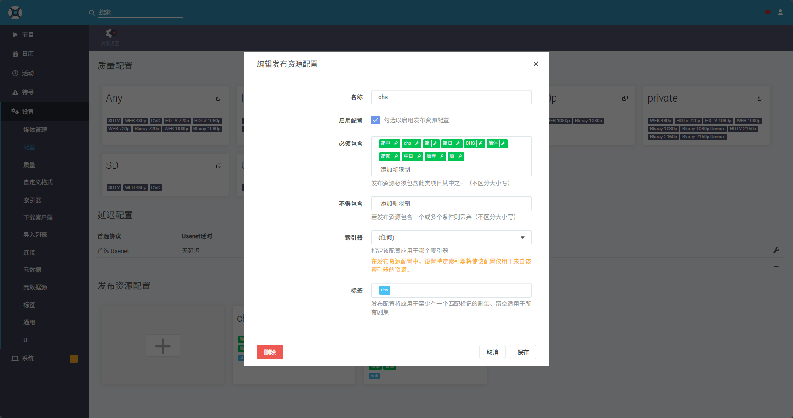
<div class="text-center">Sonarr 选择带简体中文字幕的资源</div>

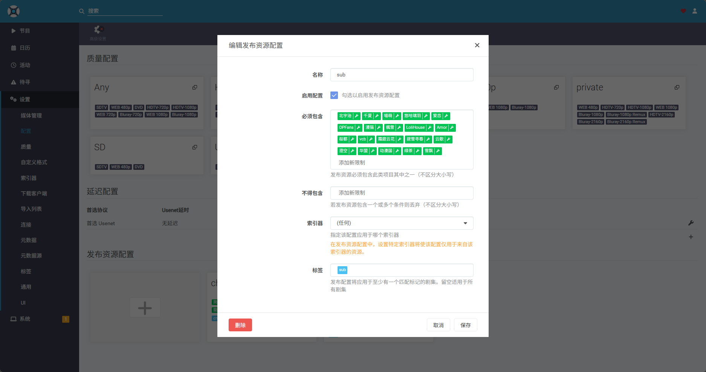
<div class="text-center">Sonarr 选择指定字幕组的资源</div>

### 手动导入媒体资源

- 有各种奇奇怪怪的原因，会导致 Sonarr 无法检索到某些资源，可能是发种信息不完整，可能是命名格式不符合 Sonarr 要求，也可能是资源本身质量不佳等。这种情况下，可以手动导入资源。比如我正在追的一部番剧《我推的孩子》，简中资源还没有出来，但我又想立马看，那么可以在 [Mikan](https://mikanani.kas.pub/) 里找到对应的资源，通过 qBittorrent 下载到本地后，在 qBittorrent 手动指定 Sonarr 分类，此时 Sonarr 就会在“活动”-“队列”中识别到该资源。导入成功后，Sonarr 会整理到指定的目录并重命名，方便 Jellyfin 进行媒体库刮削管理。

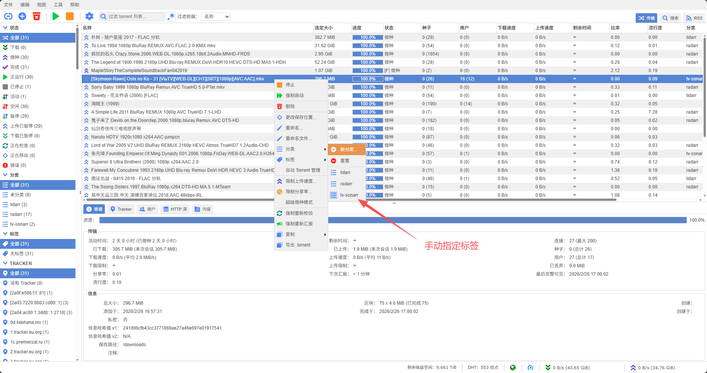
<div class="text-center">qBittorrent 手动指定 Sonarr 分类</div>

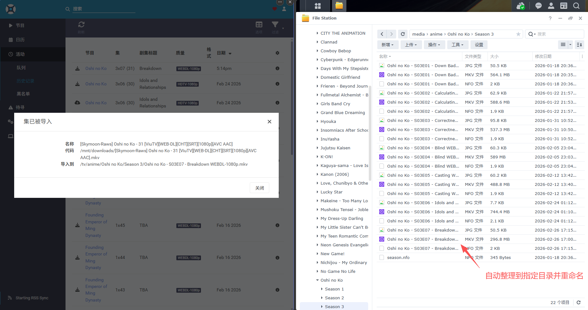
<div class="text-center">Sonarr 手动导入</div>

### 通知

- Sonarr 支持多种通知方式。可以在 Sonarr 界面左侧导航栏选择“设置”，然后选择“连接”，点击“加号”，选择需要的通知方式，填写对应的参数，保存即可。比如可以配置 Telegram 机器人，当有新的资源下载完成时，发送通知到 Telegram。

## Radarr

Radarr 是 Arr 家族中负责电影管理的工具，功能和 Sonarr 类似，支持自动搜索、下载、整理和管理电影资源。同样通过 Prowlarr 提供的索引器进行搜索，并通过 qBittorrent 进行下载，最后将下载好的资源整理到指定的目录中，方便 Jellyfin 进行媒体库管理。


<div class="text-center">Radarr 界面</div>

### 安装

可以参考 LinuxServer 提供的 [文档](https://docs.linuxserver.io/images/docker-radarr/) 进行搭建。Radarr 和 Sonarr 的界面和配置基本类似。

<details>
<summary>Radarr Docker Compose 示例</summary>

```yaml
---
services:
  radarr:
    image: lscr.io/linuxserver/radarr:latest
    container_name: radarr
    environment:
      - PUID=1000
      - PGID=1000
      - TZ=Asia/Shanghai
    volumes:
      - /path/to/radarr/data:/config
      - /path/to/movies:/movies # Jellyfin 的电影媒体库目录
      - /path/to/download-client-downloads:/downloads # qBittorrent 的下载目录
    network_mode: bridge
    ports:
      - 7878:7878
    restart: unless-stopped
```

</details>

### 配置下载客户端

[参考 Sonarr 配置](#配置下载客户端)

### 一些 Radarr 配置建议

- 在 Radarr 中，可以配置重命名格式，并且支持中文重命名（Sonarr 也支持重命名格式修改，但跟 Radarr 不同，Sonarr 不支持重命名中文标题）。

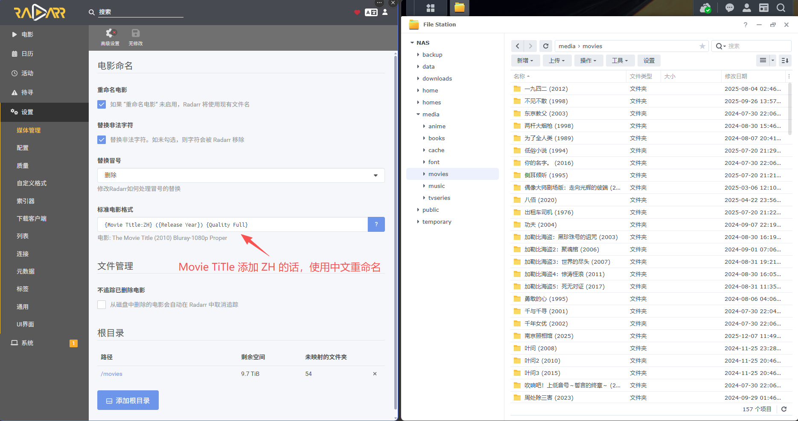
<div class="text-center">Radarr 重命名设置</div>

## Lidarr

Lidarr 是 Arr 家族中负责音乐管理的工具，功能和 Sonarr、Radarr 类似，支持自动搜索、下载、整理和管理音乐资源。同样通过 Prowlarr 提供的索引器进行搜索，并通过 qBittorrent 进行下载，最后将下载好的资源整理到指定的目录中，方便 Jellyfin 进行媒体库管理。**不过 Lidarr 是基于专辑进行管理的，并不适合单曲的管理，这个真的见仁见智。**


<div class="text-center">Lidarr 界面</div>

### 安装

可以参考 LinuxServer 提供的 [文档](https://docs.linuxserver.io/images/docker-lidarr/) 进行搭建。

<details>
<summary>Lidarr docker compose 示例</summary>

```yaml
---
services:
  lidarr:
    image: lscr.io/linuxserver/lidarr:latest
    container_name: lidarr
    environment:
      - PUID=1000
      - PGID=1000
      - TZ=Asia/Shanghai
    volumes:
      - /path/to/lidarr/config:/config
      - /path/to/music:/music #Jellyfin 的音乐媒体库目录
      - /path/to/downloads:/downloads #qBittorrent 的下载目录
    network_mode: bridge
    ports:
      - 8686:8686
    restart: unless-stopped
```

</details>

### 配置下载客户端

[参考 Sonarr 配置](#配置下载客户端)

### Lidarr 导入建议

- Lidarr 元数据使用的是 [MusicBrainz](https://musicbrainz.org/) 服务，所以需要善用 [MusicBrainz](https://musicbrainz.org/) 进行专辑搜索和添加，比如我检索一张陈奕迅的 Time Flies 专辑。我需要获取专辑的 release-group 号，然后再到 Lidarr 里进行搜索。推荐使用 release-group 进行搜索，首先是同名的专辑非常多，就这一张专辑，搜索结果有十多张同名专辑还是不同歌手，很难区分那张是陈奕迅，这也是 Lidarr 推荐的搜索方法


<div class="text-center">MusicBrainz 搜索</div>


<div class="text-center">Lidarr 搜索</div>

- 歌曲因为版本众多，且索引器对音乐支持实话说并不好，所以建议音乐都是手动导入，虽然麻烦一些，但可以保证资源的质量和完整性


<div class="text-center">复制文件到指定文件夹里</div>

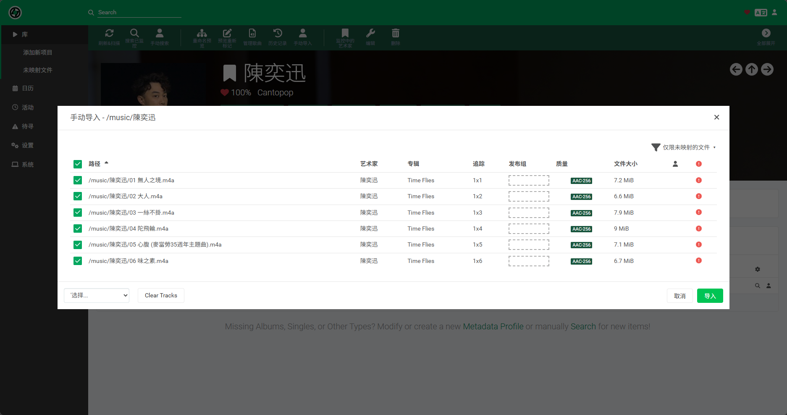
<div class="text-center">Lidarr 手动导入</div>

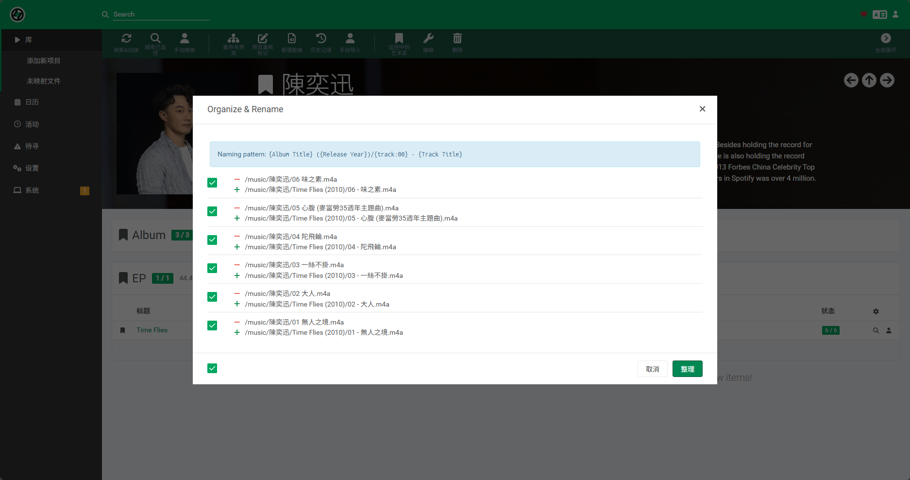
<div class="text-center">Lidarr 重命名音乐</div>

### 音源推荐

- [nyaa](https://nyaa.si/)，一个专注于动漫资源的 BT 站点，虽然主要是动漫资源，但也包含动漫相关的音乐资源
- [Apple Music](https://music.apple.com/cn/new)，主流的音乐平台，可以通过一些第三方工具（比如 [gamdl](https://github.com/glomatico/gamdl)）来下载音乐资源，但需要订阅服务
- [khinsider](https://downloads.khinsider.com/)，一个游戏音乐资源的站点，可以配合工具批量下载（比如 [KhinsiderDownloader](https://github.com/weespin/KhinsiderDownloader)）
- [hires 吧](https://tieba.baidu.com/f?kw=hires&ie=utf-8)，贴吧也有一些音乐资源的分享，虽然质量参差不齐，但也不失为一个资源来源，大部分通过网盘下载

### 播放器推荐

- [Feishin](https://github.com/jeffvli/feishin)，一个 WEB 端的音乐播放器，支持 Jellyfin


<div class="text-center">Feishin 界面</div>

- [Symfonium](https://www.symfonium.app/)，一个安卓端的音乐播放器，支持 Jellyfin

## Prowlarr

Prowlarr 是 Arr 家族中负责索引器管理的工具，支持多种索引器，可以集中管理和配置，方便其他 Arr 系列软件调用。实际上还有同类的软件（如 Jackett），但 Prowlarr 是专门为 Arr 系列设计的，集成度更高，会将索引器自动同步到 Sonarr、Radarr、Lidarr 等软件中，省去了 Jackett 添加索引器后还得在各 Arr 软件中手动添加配置的麻烦。

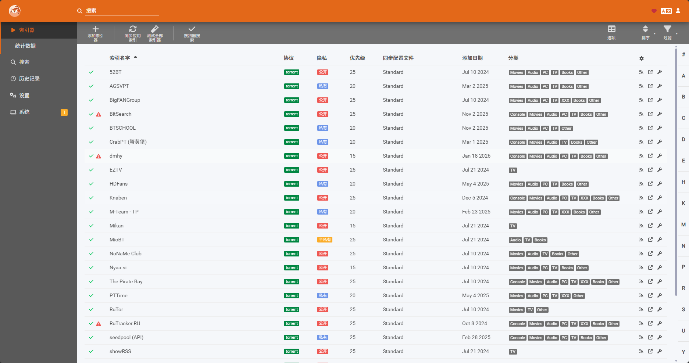
<div class="text-center">Prowlarr 界面</div>

### 安装

可以参考 LinuxServer 提供的官方镜像 [文档](https://docs.linuxserver.io/images/docker-prowlarr/) 进行搭建。

<details>
<summary>Prowlarr Docker Compose 示例</summary>

```yaml
---
services:
  prowlarr:
    image: lscr.io/linuxserver/prowlarr:latest
    container_name: prowlarr
    environment:
      - PUID=1000
      - PGID=1000
      - TZ=Asia/Shanghai
    volumes:
      - /path/to/prowlarr/data:/config
    network_mode: bridge
    ports:
      - 9696:9696
    restart: unless-stopped
```

</details>

### 添加应用程序

在 Prowlarr 界面左侧导航栏选择“应用程序”，然后点击右上角的“添加应用程序”，选择需要添加的 Arr 系列软件（Sonarr、Radarr、Lidarr 等），填写对应的软件地址和 API 密钥，保存即可。

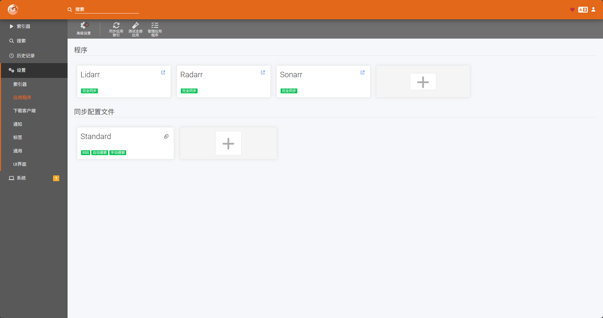
<div class="text-center">添加 Sonarr、Radarr、Lidarr 应用并同步索引器</div>

### 一些 Prowlarr 配置建议

- 如果你有 PT 站点，Prowlarr 支持大部分 PT 站点的索引器，可以在 Prowlarr 中添加对应的索引器，方便后续 Arr 系列软件调用。
- 对于公共索引器，可以根据网络环境添加多个，增加下载资源的丰富度。尽管大部分公共索引器面向国外，且大多不带中文字幕，但总的来说也不是不能用，对于电影大部分能找到资源，国外电视剧也大部分能找到，但你要说找国内的作品，比较困难，建议是入门 PT
- 对于番剧，Nyaa、dmhy、Mikan 基本能找到大部分番剧资源。


<div class="text-center">添加索引器</div>


<div class="text-center">Prowlarr 自动同步到 Sonarr 索引器</div>

## Jellyfin

Jellyfin 是一款开源免费的媒体服务器软件，支持多种媒体格式。其可以通过 WebUI、移动端应用、智能电视等多种方式访问和播放，还支持用户管理、权限控制、插件扩展等功能，非常适合个人影视库的搭建。


<div class="text-center">Jellyfin 界面</div>

### 安装

可以参考 LinuxServer 提供的官方镜像 [文档](https://docs.linuxserver.io/images/docker-jellyfin/)。

<details>
<summary>Jellyfin Docker Compose 示例</summary>

```yaml
---
services:
  jellyfin:
    image: lscr.io/linuxserver/jellyfin:latest
    container_name: jellyfin
    environment:
      - PUID=1000
      - PGID=1000
      - TZ=Asia/Shanghai
      - DOCKER_MODS=linuxserver/mods:jellyfin-opencl-intel|linuxserver/mods:universal-package-install # 使用 GPU 转码需要安装该 mod，另外一个 mod 则是允许你执行 apt 指令安装字体包，相关 issue 可以查看：https://github.com/linuxserver/docker-jellyfin/issues/161
      - INSTALL_PACKAGES=fonts-noto-cjk-extra
    volumes:
      - /path/to/jellyfin/library:/config
      - /path/to/tvseries:/data/tvshows
      - /path/to/movies:/data/movies
    devices:
      - /dev/dri:/dev/dri # GPU 转码需要挂载该设备
    network_mode: host
    restart: unless-stopped
```

</details>

### GPU 转码配置

如果在 Jellyfin 中挂载了 `/dev/dri` 设备，可以开启视频转码功能。由服务器提供转码服务，不同显卡支持的硬件解码格式不同，需要按照自己的设备进行选择。比如有些显卡并不支持 AV1 硬件解码。另外注意“转码路径”这个设置，这是转码触发时产生的临时文件路径。如果处理不当导致系统空间不足，可能会使整个系统崩溃，所以我是放在存放媒体的文件夹下（足够大）。

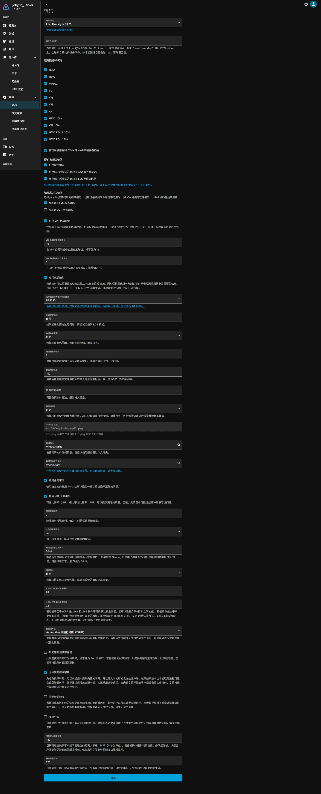
<div class="text-center">Jellyfin 转码设置</div>


<div class="text-center">Jellyfin 播放界面：可以看到左侧播放方式为转码，右侧为直接播放，转码帧率为 368 fps。当转码帧率大于视频原始帧率时，即可认为该视频可以流畅转码播放。</div>

### 一些 Jellyfin 配置建议

- 添加媒体库时，建议选择对应的内容类型（电视剧、电影），这样可以更好地刮削元数据和封面。由于都是通过 Sonarr 或 Radarr 整理好的目录结构，Jellyfin 通常都可以正确识别并刮削元数据。
- 遇到转码问题时，可以查看 Jellyfin 的日志文件来排查问题。
- 如果想在 Jellyfin 观看时想要弹幕功能，可以使用 [jellyfin-danmaku](https://github.com/Izumiko/jellyfin-danmaku) 来实现。


<div class="text-center">Jellyfin 播放显示弹幕</div>

## Bazarr

Bazarr 是一款字幕管理工具，支持自动搜索、下载和管理字幕资源。其可以与 Sonarr、Radarr 集成，自动为下载的媒体资源匹配和下载字幕，支持多种字幕源和语言。

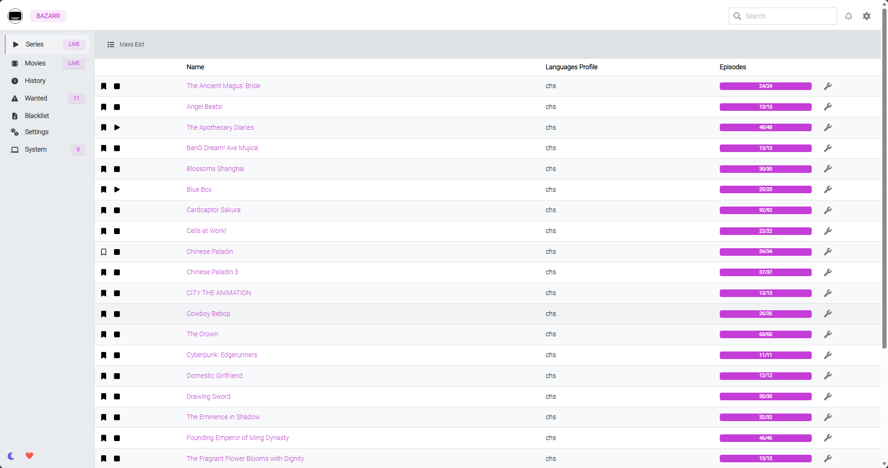
<div class="text-center">Bazarr 界面</div>

### 安装

可以参考 LinuxServer 提供的官方镜像 [文档](https://docs.linuxserver.io/images/docker-bazarr/) 进行搭建。

<details>
<summary>Bazarr Docker Compose 示例</summary>

```yaml
---
services:
  bazarr:
    image: lscr.io/linuxserver/bazarr:latest
    container_name: bazarr
    environment:
      - PUID=1000
      - PGID=1000
      - TZ=Asia/Shanghai
    volumes:
      - /path/to/bazarr/config:/config
      - /path/to/movies:/movies
      - /path/to/tv:/tv
    network_mode: bridge
    ports:
      - 6767:6767
    restart: unless-stopped
```

</details>

Bazarr 对简体中文环境的字幕自动匹配表现一般，很少有字幕可以完美匹配电影，番剧也很难匹配到对应的字幕（尽管它支持国内常用的字幕站点），且界面暂不支持中文。

很多人都推荐使用 [ChineseSubFinder](https://github.com/ChineseSubFinder/ChineseSubFinder)，但作者已经停更，[停更公告](https://github.com/ChineseSubFinder/ChineseSubFinder/blob/master/SeeYou/README.md)，所以目前我处理字幕仍然是使用 Bazarr。

我的使用习惯通常是手动批量导入字幕。对于具有多集的番剧，Bazarr 支持通过 `SxEPx` 格式识别第几季第几集的字幕。因此我会将下载好的字幕文件重命名为 `SxEPx` 格式，这样 Bazarr 就能正确识别并匹配到对应的媒体资源，无需手动逐一匹配。

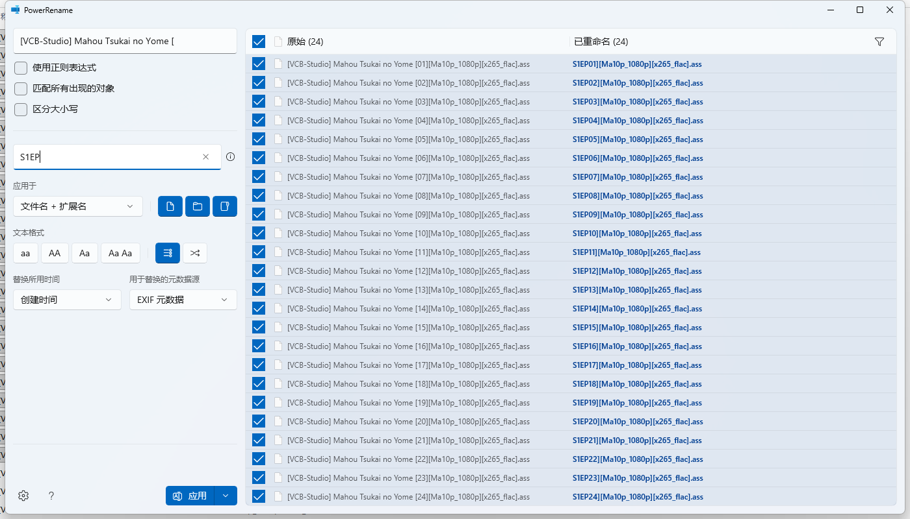
<div class="text-center">使用 PowerToys 的 PowerRename 工具重命名</div>

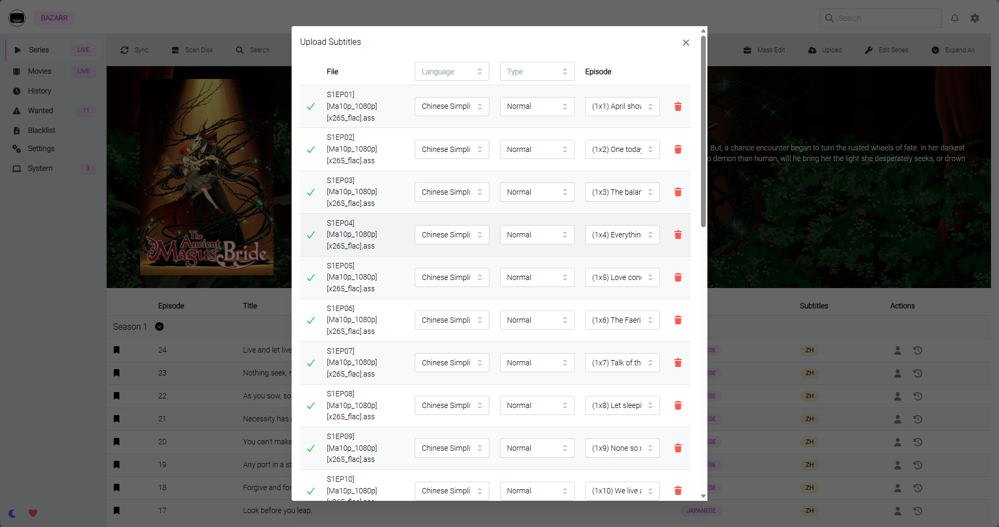
<div class="text-center">Bazarr 选中多个字幕文件后，自动匹配集数</div>


<div class="text-center">Bazarr 导入后会自动重命名字幕文件，Jellyfin 能正确识别</div>

不过 Bazarr 这个项目引入 AI 的支持，使用 AI 来生成字幕，但我还没有仔细研究过（毕竟 N100 跑大模型...）
### 字幕源推荐

- [Anime 字幕论坛](https://bbs.acgrip.com/)：几乎可以找到所有番剧的字幕资源。

## Seerr

Seerr 是一款媒体请求工具，支持用户通过 WebUI 提交媒体请求，可以与 Jellyfin 及 Arr 系列集成，方便管理媒体资源的请求与添加。


<div class="text-center">Seerr 界面</div>

### 安装

可以参考 Seerr 提供的 [文档](https://docs.seerr.dev/) 进行搭建。

<details>
<summary>Seerr docker compose 示例</summary>

```yaml
---
services:
  seerr:
    image: ghcr.io/seerr-team/seerr:latest
    init: true
    container_name: seerr
    environment:
      - LOG_LEVEL=debug
      - TZ=Asia/Tashkent
      - PORT=5055
    ports:
      - 5055:5055
    volumes:
      - /path/to/appdata/config:/app/config
    network_mode: bridge
    healthcheck:
      test: wget --no-verbose --tries=1 --spider http://localhost:5055/api/v1/status || exit 1
      start_period: 20s
      timeout: 3s
      interval: 15s
      retries: 3
    restart: unless-stopped
```

</details>

### 一些 Seerr 配置建议

- 在 Jellyfin 中申请 API 密钥，然后在 Seerr 中设置 Jellyfin 地址和 API 密钥。
- 请求番剧资源时，可以自动添加标签，以便让 Sonarr 仅下载带有中文字幕的资源。

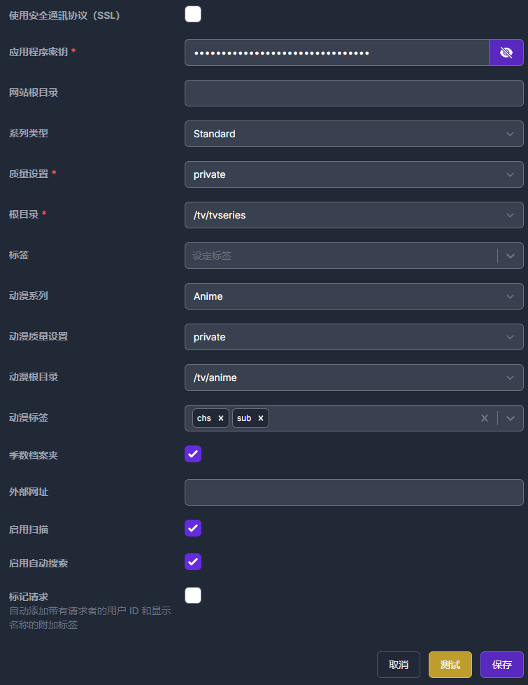
<div class="text-center">请求番剧资源时自动添加标签</div>

## 演示联动


<div class="text-center">Seerr 请求了一部电影</div>


<div class="text-center">Radarr 通过索引器检索到符合条件的资源，并推送到 qBittorrent 下载</div>

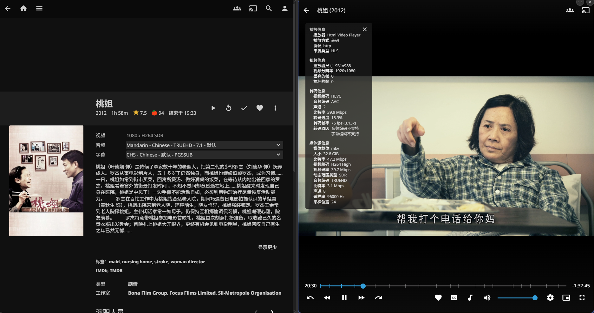
<div class="text-center">下载完成后，Radarr 自动导入并重命名，Jellyfin 刮削信息播放电影</div>

## 其他类似的软件

- [MoviePilot](https://movie-pilot.org/)：all in one 的个人影视库解决方案，集成了下载、管理、通知等功能，但需要 PT 站点认证才能正常使用。
- [ani-rss](https://github.com/wushuo894/ani-rss)：专注于番剧资源的自动下载工具，支持 RSS 订阅，配合 qBittorrent 自动下载，适合只关注番剧资源的用户。

## 最后

不同的人有不同的使用习惯，有些可能只想着搭建个 [omnibox](https://linux.do/t/topic/1089102) 导入源观看，这样也方便，也有人是追求极致的体验，本文也只是介绍了其中的一种解决方案。但大家折腾来折腾去，无外乎是想着可以随时看自己想看想听的作品，希望本文能帮助到有兴趣搭建个人影视库的朋友们，祝大家观影愉快！如果有任何问题或者建议或者更好的使用技巧，可以通过邮箱联系我。